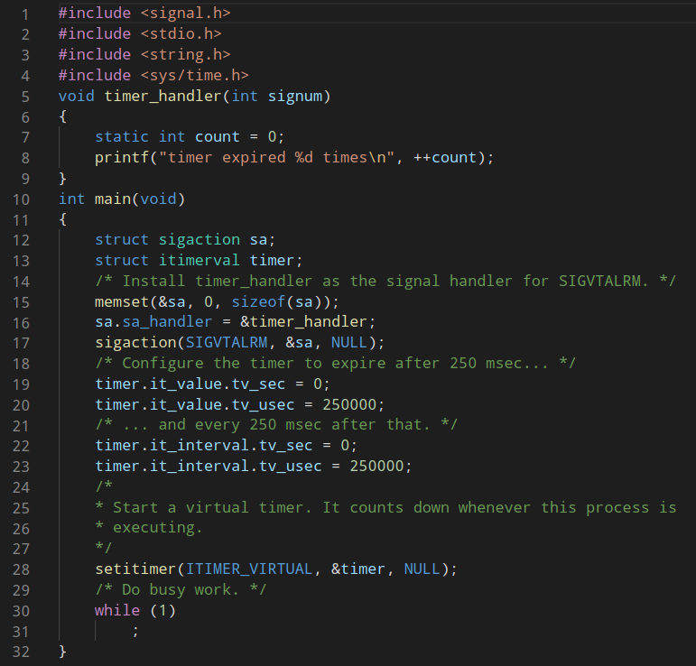
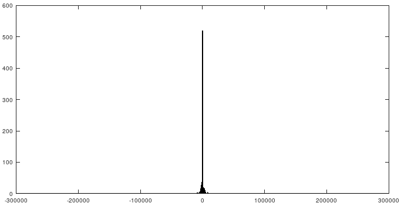
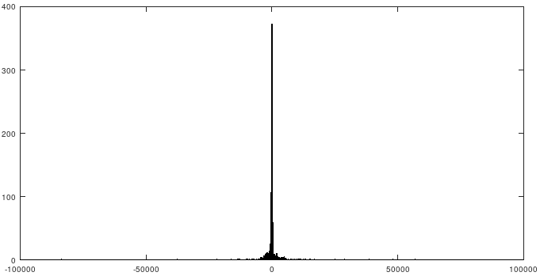
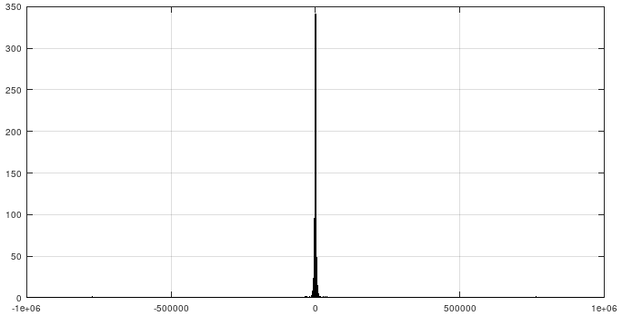

<div style="width=100%; border-bottom: 1px solid black;">
  
  
</div>

<div style=" text-align: center; clear right; line-height: 0.5;margin-top:200px;">
  <p style="font-size: 40px;">
    Laboratoire 02 - PTR
  </p>
  <p style="font-size:25px;">
    Limites de Linux dans un contexte temps réel
  </p>
</div>
<div style=" text-align: center; clear right; line-height: 0.5; margin-top:300px;">
  <p style="font-size: 20px; font-weight:bold">Auteur:</p>
  <p style="font-size:20px;">Denis Bourqui</p>
  <p style="font-size: 20px; font-weight:bold">Professeur:</p>
  <p style="font-size:20px;">Yann Thoma</p>
  </br>
  <p style="font-size: 16px; font-weight:bold">Salle:</p>
  <p style="font-size:16px;">A07</p>
</div>
<div style="page-break-after: always"></div>
## Partie 1
##### gettimeofday 1
Avec le printf dans chaque itération nous avons de temps de boucle d'environ 3 à 5 micros secondes.
```Bash
18 : 1601551376.570838
19 : 1601551376.570842
20 : 1601551376.570845
21 : 1601551376.570849
```
##### gettimeofday2
Avec le printf à la fin par contre on arrive à faire une quantité de cycle en une micro seconde!
```
 0 : 1601551742.217014
 1 : 1601551742.217015
 ...
 29 : 1601551742.217015
```
On voit que le printf prend beaucoup de temps à être exécuté. En plus on sait maintenant que le printf n'est pas délégué, mais c'est le thread lui-même qui le fait.
La granulaté du `gettimeofday()` est d'une micro seconde.
## Posix Time
```C
#include <time.h>
#define NB_MESURES 30
int main(int argc, char **argv)
{
    struct timespec tp[NB_MESURES];
    int i;
    for (i = 0; i < NB_MESURES; ++i)
    {
        // get time of realtime clock
        clock_gettime(CLOCK_REALTIME, tp + i);
    }
    for(i = 0; i < NB_MESURES;++i){
        // Print times in nano seconds
        printf("%2d : %ld.%9ld\n", i, tp[i].tv_sec, tp[i].tv_nsec);
    }
    return EXIT_SUCCESS;
}
```
Donne le résultat: 
```
 0 : 1601552884.156410286
 1 : 1601552884.156410471
 2 : 1601552884.156410570
 3 : 1601552884.156410627
 4 : 1601552884.156410677
 5 : 1601552884.156410732
```
On voit que cet accès de clock se fait avec une vitesse de 0.1 à 0.2 micros secondes. Il est donc similaire à `gettimeofday()`.
La résolution par contre est en nanosecondes et pas en microsecondes comme avec `gettimeofday()`. Si on utilise de temps précis il est donc mieux d'utiliser le timer de POSIX.
## Alarm 

Ce code il commence par initialiser un handler pour l'arrivée d'un signal SIGVTALRM. Ce signal est émis par une alarme virtuelle qui finit son cycle.
Après on initialise une alarme qui envoie ce signal toutes les 250 millisecondes. À chaque fois que le temps écoule, la fonction timer_handler est appelée.
## Mesure de précision sur les alarmes
Voici le code pour mesurer l'intervalle d'une alarme qui devrait parvenir tous les x micros secondes:
```C
#include <signal.h>
#include <stdio.h>
#include <stdlib.h>
#include <string.h>
#include <sys/time.h>
#include <time.h>

timer_t timer;
struct itimerspec spec;
int nbMesure = 0;
struct timespec *alarmTimes;
long long nsec = 0;
void timer_handler(int signum)
{
    static int count = 0;
    
     if(count == nbMesure){
        #ifdef DEBUG
        fprintf(stdout, "first timer came at %ld.%9ld\n", alarmTimes[0].tv_sec, alarmTimes[0].tv_nsec);
        #endif
        for(int i = 1; i < nbMesure; ++i){
            long long timediff_s = alarmTimes[i].tv_sec - alarmTimes[i-1].tv_sec; 
            long long timediff_ns = alarmTimes[i].tv_nsec - alarmTimes[i-1].tv_nsec;
            unsigned long long timediff = (timediff_s * 1e9) + timediff_ns ;
            #ifdef DEBUG
            fprintf(stdout, "alarm %d came at %ld.%9ld and had a interval to the timer before of %lldns,
                    which is %lldns to late\n",
                    i, alarmTimes[i].tv_sec, alarmTimes[i].tv_nsec, timediff, timediff - nsec);
            #else
            fprintf(stdout, "%lld\n", timediff - nsec);
            #endif
        }
        exit(0);
    }else{
        clock_gettime(CLOCK_REALTIME, alarmTimes + count);
    }
    count++;
}
int main(int argc, char **argv){
    int microsec;
    struct sigevent event;
    
    if (argc != 3)
    {
        fprintf(stderr, "Usage: %s NB_MESURES INTERVAL_micros\n", argv[0]);
        return EXIT_FAILURE;
    }
    nbMesure = atoi(argv[1]);
    microsec = atoi(argv[2]);
    #ifdef DEBUG
    fprintf(stdout, "init application with %d mesurements and interval of %dmicros\n", nbMesure, microsec);
    #endif
    //allouer de la memoire pour les resultat
    alarmTimes = calloc(nbMesure, sizeof(struct timespec));
    if(alarmTimes == NULL){
        fprintf(stderr, "Error on Memory Allocation");
        return EXIT_FAILURE;
    }
    // Configurer le timer
    if(signal(SIGRTMIN, timer_handler)){
        fprintf(stderr, "Error on signal function");
        return EXIT_FAILURE;
    }

    event.sigev_notify = SIGEV_SIGNAL;
    event.sigev_signo = SIGRTMIN;
    nsec = microsec * 1e3; // en nanosec
    spec.it_interval.tv_sec = nsec / 1e9;
    spec.it_interval.tv_nsec = nsec % (int)1e9;
    spec.it_value = spec.it_interval;
    // Allouer le timer
    if(timer_create(CLOCK_REALTIME, &event, &timer)){
        fprintf(stderr, "Error on signal timer_create");
        return EXIT_FAILURE;
    }
    // Programmer le timer
    if(timer_settime(timer, 0, &spec, NULL)){
        fprintf(stderr, "Error on signal timer_settime");
        return EXIT_FAILURE;
    }
    
    while(1);
}
```
#### Tests
| Intervalle attendu | nb de mesures | min         | max        | mean     |
| ------------------- | ------------- | ----------- | ---------- | -------- |
| 250 micro s         | 1000          | -243'614 ns | 249'608 ns | -14.3 ns |
| 500 micros s         | 1000          | -97'390 ns  | 98'129 ns  | -8.8 ns  |
| 1000 micros s        | 1000          | -773'290 ns | 765'215 ns | -6.0 ns  |
On voit qu'on moyenne les alarmes arrivent trop tôt par rapport à leur moment d’échéance.
Les valeurs extrêmement ne dépassent pas les 0.6 milli secondes ce qui est à mon avis assez précis.
#### Octave
##### 250 micros secondes

##### 500 micros secondes

##### 1000 micros secondes

#### Commentaire
On voit dans les 3 mesures qu'on a une répartition qui rassemble à une gaussienne. Toutes centrée autour de 0 ce qui est très bien. 
## Perturbation
#### nice
```bash
  Total of 999 values 
    Minimum  = -69'737.000000 (position = 485) 
    Maximum  = 67'513.000000 (position = 484) 
    Sum      = -3288.000000 
    Mean     = -3.291291 
    Variance = 26662724.428663 
    Std Dev  = 5163.596075 
    CoV      = -1568.866326 
```
Nice ne change pas beaucoup le résultat. Probablement, car il n’y a pas d'autres processus qui utilisent beaucoup de ressources. 
#### cpu loop
```bash
  Total of 999 values 
    Minimum  = -26'713.000000 (position = 872) 
    Maximum  = 25'093.000000 (position = 871) 
    Sum      = -9911.000000 
    Mean     = -9.920921 
    Variance = 6971394.176930 
    Std Dev  = 2640.339784 
    CoV      = -266.138578 
```
On voit que la moyenne augmente un peu, mais pas drastiquement.
#### Opération en parallèle
En me limitant sur 1 cœur pour le programme timer. En parallèle je compile depuis source l'environnement ROS (sur tous les coeurs). 
```Bash
  Total of 999 values 
    Minimum  = -983549.000000 (position = 572) 
    Maximum  = 19706995.000000 (position = 869) 
    Sum      = 329984379.000000 
    Mean     = 330314.693694 
    Variance = 3814277877626.423340 
    Std Dev  = 1953017.633721 
    CoV      = 5.912597
```
On voit qu’en moyenne on est 0.3 millisecondes à côté!

#### réception d'un ping

```Bash
  Total of 999 values 
    Minimum  = -32'470.000000 (position = 442) 
    Maximum  = 32'365.000000 (position = 441) 
    Sum      = -8326.000000 
    Mean     = -8.334334 
    Variance = 2650043.093426 
    Std Dev  = 1627.895296 
    CoV      = -195.323973
```

Aussi ici il n'y a pas de difference très significative.